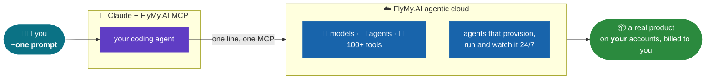

# Build with FlyMy.AI 🛠️

**FlyMy.AI is text-programmable AI infrastructure.** You describe the AI backend of your product in plain text - the agents, the model chains, the tools they call - and it gets built, frozen into an API and hosted for you in minutes. No GPUs to rent, no provider accounts to open, no pipeline code to maintain.

So we pointed it at venture-funded products and rebuilt their cores. **We built a Higgsfield in one session** - see it running on the [FlyMy.AI media demo stand](https://flymy.ai/media). You can build yours the same way, on the same infra, today.

Each demo here is a real app built from **~one prompt** - sometimes a couple more, the point is that nobody wrote a pipeline - with Claude as the builder, the **[FlyMy.AI](https://flymy.ai) agentic cloud** as the backend, and the receipts published: code, agent recipe, and a BUILD_LOG with our real bill.

And you are not limited to one. Spin up **as many agents as your product needs** - one per feature, per workflow, per customer - chain them, schedule them, embed them into whatever you are shipping. The infra is the same for a weekend demo and for the AI backend of your company.

We reproduce **$700M-$9B venture-funded products** for the price of two tools: a **$200/mo Claude Max** plan + a **~$20/mo agent-infra** subscription + pay-per-use FlyMy.AI - then run them for pennies.



The scoreboard - one cheap kit vs a venture-funded startup:

| Demo | Kills | They're worth | Built on FlyMy.AI | You run it for | Their subscription | The kill |
|---|---|---|---|---|---|---|
| [WhisperFly](https://github.com/FlyMyAI/whisperfly) 🎙️ | Wispr Flow · dictation | **$700M** | ~$20/mo agent-infra + FlyMy usage (+$200 Claude Max) | **$0** + $0.03/note | $12-15/mo | dictation is **free** |
| [replifly](https://github.com/FlyMyAI/replifly) 🚀 | Replit · deploy-to-prod | **$9B** | ~$20/mo agent-infra + FlyMy usage (+$200 Claude Max) | **~$3/mo** | $25-45/mo | **~10x** cheaper |
| [higfly](https://github.com/FlyMyAI/higfly) 🎬 | Higgsfield · AI video | **$1.3B** | ~$20/mo agent-infra + FlyMy usage (+$200 Claude Max) | **~$0.30/clip** | $9-49/mo | **no subscription** |
| **more coming soon** 🎯 | your suggestion | | | | | **we are coming for the rest** |

## Say it, and it exists

Connect the MCP once:

```bash
claude mcp add --transport http flymyai https://mcp-agents.flymy.ai/mcp
```

Then paste any of these into your coding agent. Each one produces a real AI backend - agents created, run, frozen into an API and hosted on FlyMy.AI - plus a client or landing page in front of it.

**Your own Higgsfield** - a cinematic video studio:

```text
Claude, build me a Higgsfield-style video studio: a landing page where a user
types a shot and picks a camera move, and on FlyMy.AI a set of agents that
render it. Camera moves I want: 1) crash zoom, 2) dolly in, 3) orbit around
the subject, 4) crane up reveal, 5) FPV drone flythrough, 6) handheld follow.
Pick the best video model for cost and quality, freeze the working agent into
an API, host it there and hand me the endpoint plus the real price per clip.
Go.
```

**Your own Wispr Flow** - dictation that files itself:

```text
Claude, build me a dictation backend on FlyMy.AI: I record audio, an agent
transcribes it, cleans up the text, tags it and files it into my Notion.
Freeze it into an API, host it, then give me a tiny local client that sends
the audio and shows the Notion link. Tell me the real cost per note. Go.
```

**Your own Replit** - one sentence to production:

```text
Claude, take this repo and put it in production through FlyMy.AI: pick the
host, provision a Postgres database, wire error tracking, and create an agent
that watches the deployment and calls me when it breaks. My accounts, my
keys. Hand me the live URL. Go.
```

**A content factory** - the same recipe at volume:

```text
Claude, build a content pipeline on FlyMy.AI: from one product photo and a
brief, generate 8 on-brand images, turn each into a short video, stitch them
into one reel, and expose the whole thing as a single API call I can run over
my whole catalog. Freeze it and tell me the cost per product. Go.
```

**An always-on research agent** - work that happens without you:

```text
Claude, build me a research agent on FlyMy.AI: every morning it searches the
web for what changed in my market, reads the sources, writes a short digest
and emails it to me. Schedule it in your cloud so it runs whether my laptop
is open or not. Go.
```

Whatever the use case, the shape is the same: **text in, a hosted AI backend out.** The demos below are just the ones we published with receipts.

## More coming soon

Three down. Anything whose core feature is really a chain of model calls is on the table: image and video studios, transcription and meeting tools, "AI wrapper" SaaS, deploy and hosting platforms, scraping and research services. Each one is the same recipe - a prompt or two, frozen agents, a published bill.

**We are coming for the rest.** Watch this repo, or open an issue naming the product you want rebuilt next: if a prompt plus a few frozen agents can do its job, it goes on the list.

## Build your own, from ~one prompt

1. Connect FlyMy.AI to your coding agent (Claude Code / claude.ai / Codex / Antigravity) - the one line above works in all of them.
2. Grab [AGENTS.md](AGENTS.md) into your project (Claude also reads it via CLAUDE.md) - it teaches your agent the whole pattern: research -> one frozen FlyMy.AI agent -> thin open-source client -> honest BUILD_LOG.
3. Say what to build. Adapt one of the prompts above, or start from a demo's `BUILD_PROMPT.md`.

Skills for Claude Code live in [`skills/`](skills/) - drop them into `~/.claude/skills/` and your Claude knows how to build and bill-check FlyMy.AI agents.

## Rules of the series

[PLAYBOOK.md](PLAYBOOK.md): the build pattern, the killer-pitch README format, honest-claims discipline (only numbers from our own bill), the app UX bar ("launch and go"), and the self-test bar (a human only ever receives a working, click-through-ready app).

## Clone

```bash
git clone git@github.com:FlyMyAI/whisperfly.git                     # one demo
git clone --recursive git@github.com:FlyMyAI/build-with-flymyai.git # everything
```
