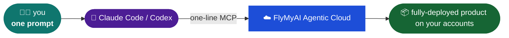

# Build with FlyMyAI 🛠️

<p align="center">
  <strong>Open-source SaaS killers powered by FlyMyAI cloud agents.</strong><br />
  We rebuild expensive subscription workflows into transparent, flat-rate systems you own.
</p>

<p align="center">
  
  
  
</p>

---

## ⚡ Quick Matrix

| Project | What it kills | Their Price | Our Price | Measured Savings | Status |
| :--- | :--- | :--- | :--- | :--- | :--- |
| [🎬 Media Cases](https://app.flymy.ai/media/) | **Higgsfield** (AI video pipeline) | $15–129/mo | **Pay-per-run** | Direct model prices, no lock-in | **Live** |
| [🎙️ WhisperFly](https://github.com/FlyMyAI/whisperfly) | **Wispr Flow** (Voice dictation) | $12–15/mo | **$0** local / **$0.031** cloud | **5–16x cheaper** | **Live** |
| [🚀 replifly](https://github.com/FlyMyAI/replifly) | **Replit** (Deploy-to-prod) | $25–45/mo | **Free-tier** hosting | **4–10x cheaper** runtime | **Live** |

---

## 🧠 How it works



---

## 🛠️ Build your own in 1 minute

```bash
# 1. Connect FlyMyAI cloud to your local coding agent
claude mcp add --transport http flymyai https://mcp-agents.flymy.ai/mcp

# 2. Tell your agent what subscription to kill
# (Use the rules in PLAYBOOK.md and the custom skill below)
```

---

## 📦 What's inside

```text
build-with-flymyai/
├── README.md                      # This matrix hub
├── PLAYBOOK.md                    # Standing rules for every demo repo
├── AGENTS.md / CLAUDE.md          # Instructions for your coding agents
└── skills/build-flymyai-app/      # Reusable Claude Code skill
```

---

<details>
  <summary><b>📖 View Playbook Rules (PLAYBOOK.md summarized)</b></summary>

  ### Core Rules for our Demos:
  - **No raw data in Git:** Keep Git repositories lightweight. All media assets must be compressed (JPEG 85%, 720p H.264 videos under 2.0 MB) and hosted via FlyMyAI S3/GCS.
  - **Only real bills:** Never publish theoretical list prices. Every cost claim must be backed by a real log in `BUILD_LOG.md`.
  - **Sell ownership, not parity:** Polish is the incumbent's advantage. Our advantage is: your keys, your database, your routing, complete portability.
  - **Rebrand forks:** Any forked open-source base must be fully rebranded under the demo's name. Downstream credit goes to `NOTICE.md`.
</details>

<details>
  <summary><b>🔌 Available MCP Tools & Capabilities</b></summary>

  Once connected, your coding agent gains direct access to:
  - `create_agent` / `freeze_agent` — design and lock server-side pipelines.
  - `run_frozen` — trigger cheap, fast, API-callable cloud runs.
  - `recommend_model` — semantic search across 1000+ top-tier open-source models.
  - `get_execution_price` — check exact billing costs programmatically.
</details>

---

## Clone the ecosystem

```bash
# Clone everything (including submodules)
git clone --recursive git@github.com:FlyMyAI/build-with-flymyai.git
```
