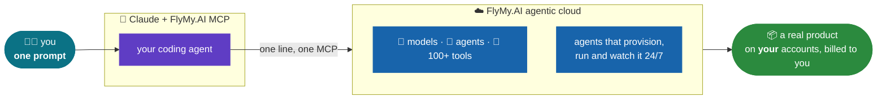

# Build with FlyMy.AI 🛠️

**We kill $15/mo subscriptions - and the startups behind them.** Each demo here is a real app built from **one prompt** - Claude as the builder, **[FlyMy.AI](https://flymy.ai) agentic cloud** as the backend - with the receipts published: code, agent recipe, and a BUILD_LOG with our real bill. We reproduce **$700M-$9B venture-funded products** for the price of two tools: a **$200/mo Claude Max** plan + a **~$20/mo agent-infra** subscription + pay-per-use FlyMy.AI - then run them for pennies.



| Demo | Kills | Startup valued at | Built on FlyMy.AI + agent-infra for | Built with Claude for | Runs on FlyMy.AI for | Their subscription | Price difference |
|---|---|---|---|---|---|---|---|
| [WhisperFly](https://github.com/FlyMyAI/whisperfly) 🎙️ | Wispr Flow (hotkey dictation) | **$700M** (~$315M raised) | ~$20/mo agent-infra + FlyMy.AI usage | $200/mo Claude Max | dictation **$0** + $0.031/note to Notion | $12-15/mo | core feature **free**, ~5-16x cheaper |
| [replifly](https://github.com/FlyMyAI/replifly) 🚀 | Replit (deploy-to-prod) | **$9B** ($400M round) | ~$20/mo agent-infra + FlyMy.AI usage | $200/mo Claude Max | ~$2-5/mo (your Fly+Neon+Sentry) | $25-45/mo + metered Agent | **~4-10x** cheaper to run |
| [higfly](https://github.com/FlyMyAI/higfly) 🎬 | Higgsfield (cinematic AI video) | **$1.3B** (~$138M raised, eyeing $5B) | ~$20/mo agent-infra + FlyMy.AI usage | $200/mo Claude Max | **~$0.20-0.50/clip** | $9-49/mo credits | pay-per-clip, **no subscription** |

## Build your own, from one prompt

1. Connect FlyMy.AI to your coding agent (Claude Code / claude.ai / Codex / Antigravity) - one line:
   ```bash
   claude mcp add --transport http flymyai https://mcp-agents.flymy.ai/mcp
   ```
2. Grab [AGENTS.md](AGENTS.md) into your project (Claude also reads it via CLAUDE.md) - it teaches your agent the whole pattern: research -> one frozen FlyMy.AI agent -> thin open-source client -> honest BUILD_LOG.
3. Say what to kill. Or start from a demo's `BUILD_PROMPT.md` and adapt.

Skills for Claude Code live in [`skills/`](skills/) - drop them into `~/.claude/skills/` and your Claude knows how to build and bill-check FlyMy.AI agents.

## Rules of the series

[PLAYBOOK.md](PLAYBOOK.md): the build pattern, the killer-pitch README format, honest-claims discipline (only numbers from our own bill), the app UX bar ("launch and go"), and the self-test bar (a human only ever receives a working, click-through-ready app).

## Clone

```bash
git clone git@github.com:FlyMyAI/whisperfly.git                     # one demo
git clone --recursive git@github.com:FlyMyAI/build-with-flymyai.git # everything
```
