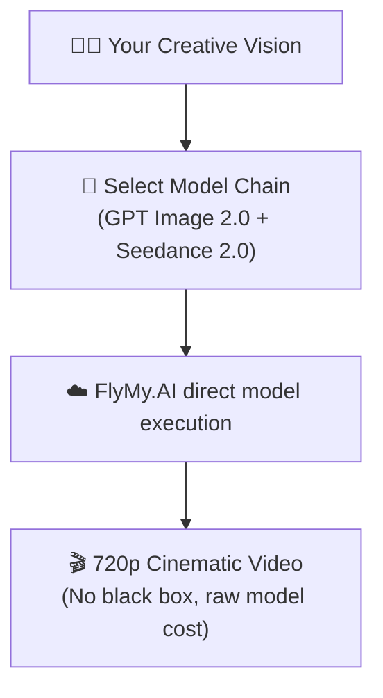

# Cinematic AI Video Workflows without the Black Box 🎬

**Higgsfield-style media cases built as transparent FlyMy.AI runs: prompts, model chain, assets, and source chats included. Pay per run, remix the workflow, keep the receipts.**

We build open-source, subscription-free creative pipelines powered by the **FlyMy.AI cloud**.

---

## ⚡ The Concept

Incumbents rent you highly-opinionated creative video platforms with complex credit packages. We give you direct model routing, direct API pricing, and complete workflow transparency. You own the prompt, you select the model chain (e.g., **GPT Image 2.0** → **Seedance 2.0**), and you run it on your own terms.



---

## 💸 The Economics

| Workflow Component | Subscription Platforms | FlyMy.AI (Pay-per-Run) |
|---|---|---|
| Monthly Subscription | **$15–$129/mo** | **$0** (Flat free infrastructure) |
| Billing Unit | Locked credit packages | Raw, direct-to-model pay-per-run |
| Workflow Visibility | Black-box sliders | Full prompt transparency & chat replays |
| Portability | Proprietary platform lock-in | Complete API & model chain ownership |

---

## 📋 Outstanding Media Cases (Sample Gallery)

| Case | Model Chain | Output Preview | Original Source | Cost |
|---|---|---|---|---|
| Cinematic Command Center | `GPT Image 2.0` → `Seedance 2.0` | [🎥 Video Clip](https://storage.googleapis.com/open-inference-results/media/command_center.mp4) | [💬 Chat History](https://app.flymy.ai/agents/chat/sample-case-1) | **$0.12** |
| Golden Hour Drone Shot | `Midjourney v6` → `Kling v1.5` | [🎥 Video Clip](https://storage.googleapis.com/open-inference-results/media/golden_hour.mp4) | [💬 Chat History](https://app.flymy.ai/agents/chat/sample-case-2) | **$0.18** |
| Cyberpunk Alley Walk | `FLUX.1-dev` → `Luma Dream Machine` | [🎥 Video Clip](https://storage.googleapis.com/open-inference-results/media/cyberpunk.mp4) | [💬 Chat History](https://app.flymy.ai/agents/chat/sample-case-3) | **$0.15** |

---

## 🛠️ Adding a New Case

To add a new visual case to our landing page showcase, follow this 4-step workflow:

### 1. Extract Chat Metadata
Retrieve the public agent chat link from [app.flymy.ai](https://app.flymy.ai) and note the models used, prompts, and final results.

### 2. Compress the Video/Image Assets
Keep your Git repository clean and lightweight. Always compress videos before publishing:
- Target resolution: **720p H.264**
- Target quality: **CRF 30–34**
- Target size: **Under 2MB per clip**
```bash
ffmpeg -i input.mp4 -vcodec libx264 -crf 32 -preset slow -acodec copy output.mp4
```

### 3. Upload to FlyMy.AI API
Use your `X-API-KEY` to upload the media file and retrieve a public CDN URL:
```bash
curl -X POST https://backend.flymy.ai/api/v1/agents/agent-file-chat-upload/ \
  -H "X-API-Key: YOUR_API_KEY" \
  -F "file=@output.mp4" \
  -F "external_id=your-uuid-here"
```

### 4. Update the Showcase Database
Add the metadata and CDN links to `demos/media-cases/data/cases.json`, and run the build script to update the landing page.
